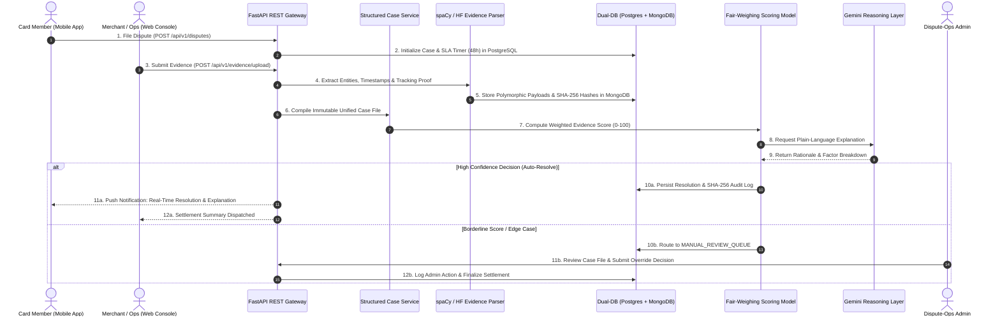

# ⚖️ VerdictAI: Frictionless Dispute & Chargeback Resolution
### *A Transparent, Evidence-Driven Engine for Resolving Contested Card Charges in Minutes, Not Weeks*

[](LICENSE)
[](https://python.org)
[](https://fastapi.tiangolo.com)
[](https://reactjs.org)
[](https://reactnative.dev)
[](https://postgresql.org)
[](https://mongodb.com)
[](https://github.com/features/actions)

---

## 📌 Executive Overview

In traditional payment ecosystems, cardholder chargebacks and merchant disputes take **2 to 6 weeks** to resolve. The process is manual, opaque, and highly adversarial: analysts manually chase receipts, carrier tracking logs, and email threads, resulting in high operational costs, lost merchant revenue, and customer frustration.

**VerdictAI** automates the entire dispute resolution lifecycle:
1. **Automated Multi-Source Evidence Ingestion:** Automatically ingests and parses transaction records, PDF invoices/receipts, carrier delivery GPS timestamps, and communication logs.
2. **Deterministic NLP Entity Extraction:** Identifies customer-merchant agreements, delivery proof, and cancellation terms via spaCy and Hugging Face pipelines.
3. **Dual-Database Segregation:** Pairs **PostgreSQL** (ACID transactional case state, audit trails, and SLAs) with **MongoDB** (polymorphic, unstructured multi-modal evidence store).
4. **Calibrated Fair-Weighing Model:** Calculates objective, weighted confidence scores (0–100) evaluating merchant vs. cardholder claims based on auditable criteria.
5. **Explainable AI (XAI) Reasoning Layer:** Uses Google Gemini API to generate plain-language resolution justifications presented to both cardholders and merchants.
6. **Human-in-the-Loop Admin Queue:** Equips Dispute-Ops analysts with an override queue to review borderline cases before final settlement.

---

## 🏗️ System Architecture & Data Flow



---

## 📂 Repository Layout

```
VerdictAI/
├── backend/                              # Core Backend Services (FastAPI)
│   ├── app/
│   │   ├── api/                          # REST Route Handlers (disputes, evidence, resolutions)
│   │   ├── core/                         # Config, Security (JWT), Dual-DB Connection Pool
│   │   ├── models/                       # PostgreSQL SQLAlchemy Models & Pydantic Schemas
│   │   ├── services/
│   │   │   ├── case_builder/             # Structured Case File Compiler (Owner: Nirav)
│   │   │   ├── state_machine/            # Lifecycle State Machine & SLA Monitor (Owner: Nirav)
│   │   │   ├── audit_engine/             # Cryptographic Hash Chaining (Owner: Nirav)
│   │   │   ├── nlp_parser/               # Receipt OCR & spaCy Dialogue Parser (Owner: Achyut)
│   │   │   ├── fair_weighing/            # Scoring Rubric & Calibration Matrix (Owner: Akshay)
│   │   │   └── reasoning_layer/          # Gemini API Explanation Generator (Owner: Darshan)
│   │   └── main.py                       # FastAPI Application Entrypoint
│   ├── tests/                            # PyTest Unit & Integration Test Suites
│   ├── Dockerfile
│   └── requirements.txt
├── frontend-web/                         # Dispute-Ops & Merchant Web Console (React.js)
│   ├── src/
│   │   ├── components/                   # DisputeQueue, EvidenceViewer, OverrideModal, AuditLog
│   │   ├── pages/                        # Dashboard, CaseDetail, MerchantPortal, Analytics
│   │   └── services/                     # Axios API Client & State Hooks
│   ├── package.json
│   └── README.md
├── mobile-app/                           # Card Member Mobile Application (React Native)
│   ├── src/
│   │   ├── screens/                      # FileDisputeScreen, CaseTrackerScreen, RationaleView
│   │   ├── navigation/                   # React Navigation Stack
│   │   └── services/                     # Mobile API & Push Notification Handlers
│   ├── package.json
│   └── README.md
├── database/                             # Database Schemas & Migrations
│   ├── postgresql/
│   │   ├── 01_init_schema.sql            # ACID Relational DDL (Disputes, Transactions, Audits)
│   │   └── 02_seed_data.sql              # Synthetic Test Fixtures
│   └── mongodb/
│       └── models.py                     # Polymorphic Evidence Schemas & Hash Checksums
├── docs/                                 # Project Documentation & Specifications
│   ├── architecture/                     # High-Level Architecture & Database ERDs
│   ├── brd/                              # Business Requirements Document (BRD)
│   └── api/                              # OpenAPI Specification (Swagger)
├── docker-compose.yml                    # Multi-container orchestration (FastAPI, Postgres, Mongo)
├── .env.example                          # Template environment variables
└── README.md
```

---

## 👥 Team & Responsibilities Breakdown

The project is developed by a 7-member engineering team with balanced domain ownership:

| # | Team Member | Role | Total Est. Hours | Core Responsibilities |
| :-: | :--- | :--- | :-: | :--- |
| **1** | **Nirav Kachhiya** (`202512011`) | **Project Lead / Backend Engineer** | **210 hrs** | System Architecture & HLD, Dual-DB schema design (PostgreSQL/MongoDB), Structured Case-File Service, State Machine, Cryptographic Audit Engine, BRD Consolidation. |
| **2** | **Achyut Pathak** (`202512039`) | **AI/NLP Engineer (Evidence Parsing)** | **208 hrs** | Evidence Ingestion pipeline, multi-modal receipt parsing, spaCy/Transformers communication dialogue entity extraction. |
| **3** | **Akshay Purohit** (`202512033`) | **ML Engineer (Fair-Weighing Model)** | **205 hrs** | Fair-Weighing mathematical scoring algorithm, evidence confidence weights, bias mitigation and rubric calibration. |
| **4** | **Darshan Prajapati** (`202512026`) | **Backend Engineer (Reasoning & APIs)** | **200 hrs** | OpenAPI contract specification, Case-Management REST APIs, Google Gemini XAI reasoning explanation layer. |
| **5** | **Rohit Peswani** (`202512115`) | **Frontend Engineer (Web - Admin/Merchant)** | **204 hrs** | React Web Console, Merchant evidence upload portal, Dispute-Ops admin queue, manual override and audit trail UI. |
| **6** | **Mayank Jayswal** (`202512093`) | **Mobile Engineer (Card Member App)** | **200 hrs** | React Native mobile application, Cardholder dispute filing flow, real-time status tracker, mobile push notifications. |
| **7** | **Hardik Kansara** (`202512036`) | **Cloud/DevOps & QA Engineer** | **203 hrs** | Shift-left continuous test strategy (unit, integration, regression, UAT), synthetic chargeback dataset generation, Render/Railway cloud infrastructure, GitHub Actions CI/CD. |

---

## 📅 Project Timeline & Milestones (15-Week Plan)

The project window runs from **4 August 2026** to **16 November 2026**:

| Phase | Dates | Milestone Deliverables | Status |
| :---: | :--- | :--- | :---: |
| **P1** | **Aug 4 – Aug 17** | **Discovery & Design:** Requirements (BRD), System Architecture, Dual-DB Schema, UI Wireframes signed off; CI/CD skeleton active. | ✅ **Completed** |
| **P2** | **Aug 18 – Sep 7** | **Evidence Pipeline:** Transaction/receipt ingestion, NLP parsing functional, Structured Case-File Service, API integration checkpoint. | 🔄 **In Progress** |
| **P3** | **Sep 8 – Sep 28** | **Fair-Weighing Model:** Weighted scoring algorithm, Gemini reasoning integration, bias/fairness calibration matrix. | ⏳ Planned |
| **P4** | **Sep 29 – Oct 19** | **Client Interfaces:** React Web Console & React Native Mobile App connected to backend APIs. | ⏳ Planned |
| **P5** | **Oct 20 – Nov 2** | **Full System Integration:** End-to-end flow connected (Submit $\rightarrow$ Parse $\rightarrow$ Score $\rightarrow$ Explain $\rightarrow$ Resolve). | ⏳ Planned |
| **P6** | **Nov 3 – Nov 9** | **Testing & Optimization:** Final regression, performance benchmarking, fairness validation, UAT with 50+ sample dispute scenarios. | ⏳ Planned |
| **P7** | **Nov 10 – Nov 15** | **Final Polish & Hosting:** Documentation, demo prep, cloud production deployment (Render/Railway). | ⏳ Planned |
| **P8** | **Nov 16** | **Project Submission:** Final hosting verification, GitHub repository, and Google Classroom submission. | ⏳ Planned |

---

## 🛠️ Technology Stack Summary

- **Web Frontend:** React.js, Tailwind CSS / Vanilla CSS, Axios
- **Mobile Frontend:** React Native, Expo, React Navigation
- **Backend & REST APIs:** FastAPI (Python 3.10+), Pydantic v2, Uvicorn
- **AI & NLP:** spaCy (`en_core_web_sm`), Hugging Face Transformers
- **Reasoning & XAI:** Google Gemini API (Flash/Pro) / OpenRouter fallback
- **Transactional Database:** PostgreSQL 14+ (ACID compliance, Foreign Keys, Audit logging)
- **Evidence Storage:** MongoDB 6.0+ (Polymorphic documents, BSON, SHA-256 integrity checksums)
- **DevOps & Hosting:** Docker, Docker Compose, GitHub Actions, Render / Railway
- **Testing Frameworks:** PyTest, PyTest-Asyncio, Jest, Postman / Newman

---

## ⚡ Getting Started (Local Development)

### 1. Clone the Repository
```bash
git clone https://github.com/AchyutPathak30/VerdictAI.git
cd VerdictAI
```

### 2. Environment Configuration
```bash
cp .env.example .env
# Edit .env and supply GEMINI_API_KEY, PG_PASSWORD, MONGO_URI
```

### 3. Run via Docker Compose
```bash
docker-compose up --build
```

### 4. Running Backend Tests Locally
```bash
# Python Virtual Environment
python -m venv venv
source venv/bin/activate  # On Windows: .\venv\Scripts\activate
pip install -r backend/requirements.txt

# Run full test suite
pytest backend/tests/ -v
```

---

## 📄 License & Academic Integrity

This project is developed as part of **IT644: Application Development Group Project** under the guidance of **Prof. JayPrakash Lalchandani**.  
Licensed under the [MIT License](LICENSE).
