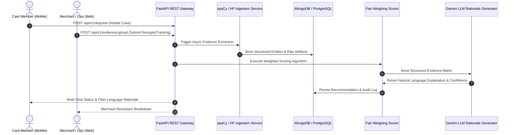

# ⚖️ VerdictAI — Automated & Explainable Dispute Resolution Engine

[](LICENSE)
[](https://python.org)
[](https://fastapi.tiangolo.com)
[](https://reactjs.org)
[](https://reactnative.dev)
[](https://postgresql.org)
[](https://mongodb.com)

**VerdictAI** is a high-throughput, explainable AI backend and multi-client system designed to automate financial dispute and chargeback evaluations. It ingests unstructured evidence (receipts, carrier delivery logs, email threads), parses entities via NLP, applies an auditable fair-weighing scoring algorithm, and produces plain-language decision rationales using Google Gemini API.

---

## 📂 Repository Layout

```
VerdictAI/
├── backend/                  # FastAPI REST API Backend
│   ├── app/
│   │   ├── api/              # API route handlers (disputes, evidence, decisions)
│   │   ├── core/             # App configuration, security, DB connections
│   │   ├── models/           # SQLAlchemy & PyDantic models
│   │   ├── services/         # NLP parsing, Fair-Weighing & Gemini XAI services
│   │   └── main.py           # Application entrypoint
│   ├── tests/                # PyTest test suite
│   ├── Dockerfile
│   └── requirements.txt
├── frontend-web/             # React.js Admin & Merchant Operations Console
│   ├── src/
│   │   ├── components/       # UI components (DisputeQueue, EvidenceViewer, OverrideModal)
│   │   ├── pages/            # Dashboard, CaseDetails, Analytics
│   │   └── services/         # Axios API client
│   └── package.json
├── mobile-app/               # React Native Cardholder App
│   ├── src/
│   │   ├── screens/          # FileDisputeScreen, CaseTrackerScreen, RationaleView
│   │   └── navigation/       # App Stack Navigation
│   └── package.json
├── docker-compose.yml        # Local orchestration (FastAPI, Postgres, Mongo, Redis)
├── .env.example              # Template environment variables
└── README.md
```

---

## 🏗️ Technical Architecture & Data Flow



---


## 👥 Core Team & Project Structure

| Role | Engineer | Domain Responsibility |
| :--- | :--- | :--- |
| **Project Lead** | **Nirav Kachhiya** (`202512011`) | Core API Architecture & Backend Coordination |
| **AI/NLP Engineer** | **Achyut Pathak** (`202512039`) | Unstructured Evidence Parser (spaCy/Transformers) |
| **ML Engineer** | **Akshay Purohit** (`202512033`) | Fair-Weighing Algorithm & Scoring Matrix |
| **Backend Engineer** | **Darshan Prajapati** (`202512026`) | Explainable AI (XAI) & Gemini Integration Layer |
| **Frontend Engineer (Web)** | **Rohit Peswani** (`202512115`) | Admin Override Queue & Merchant Portal (React) |
| **Mobile Engineer** | **Mayank Jayswal** (`202512093`) | Card Member Dispute Tracking App (React Native) |
| **DevOps & QA** | **Hardik Kansara** (`202512036`) | Docker Infrastructure, CI/CD & Automated Testing |

---
