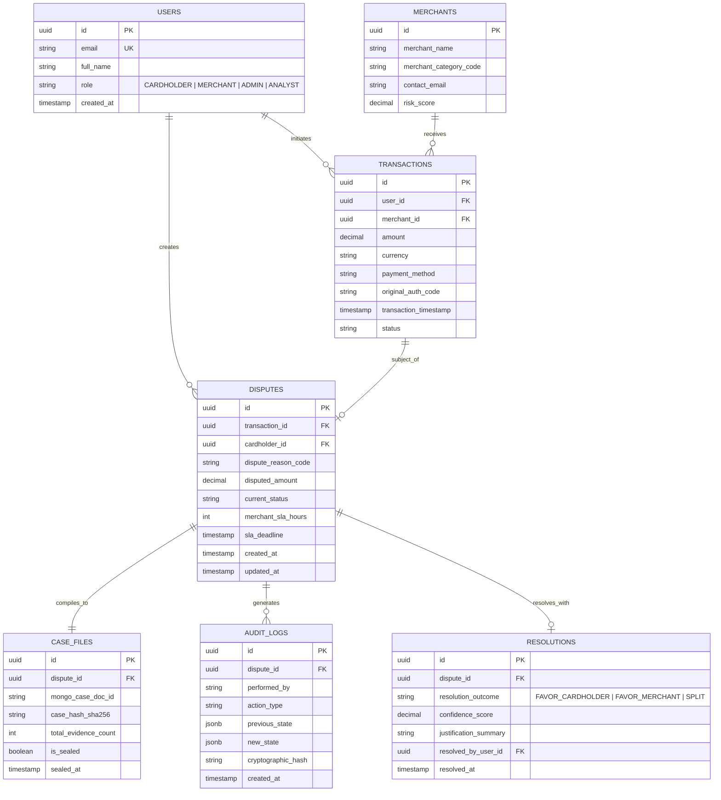

# Dual-Database Schema & Storage Architecture
## VerdictAI: Frictionless Dispute & Chargeback Resolution
**Author / Module Lead:** Nirav Kachhiya (Project Lead / Backend Engineer)  
**Document Version:** 1.0 (Phase 1 Deliverable)  
**Status:** Signed Off

---

## 1. Design Rationale for Dual-Database Architecture

A chargeback resolution platform encounters two fundamentally divergent data requirements:
1. **Transactional, High-Integrity State (PostgreSQL):** Financial transaction linkages, dispute state transitions, user roles, authentication, strict foreign key constraints, SLA deadlines, and audit trails.
2. **Polymorphic, Unstructured Evidence (MongoDB):** Raw receipt OCR tokens, PDF attachments, courier delivery GPS tracking payloads, email/chat transcripts, and arbitrary metadata.

---

## 2. PostgreSQL Relational Entity-Relationship Model

