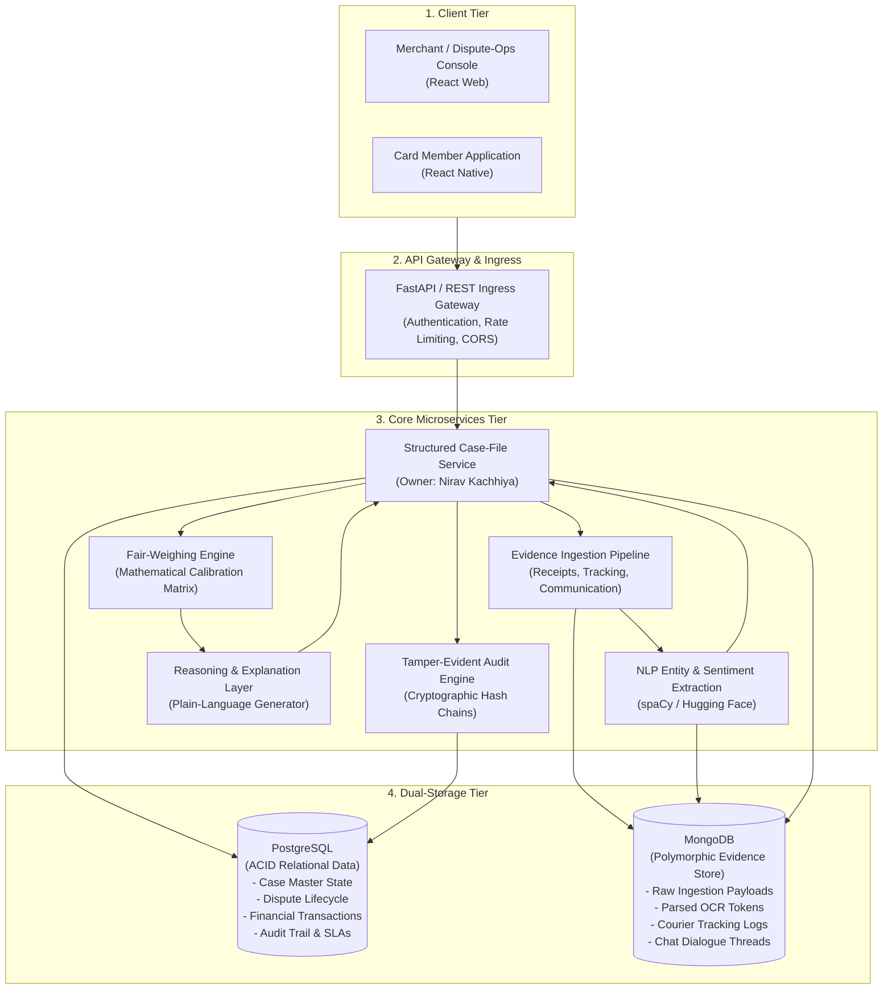

# VerdictAI: Frictionless Dispute & Chargeback Resolution
## System Architecture & High-Level Design (HLD)
**Author / Module Lead:** Nirav Kachhiya (Project Lead / Backend Engineer)  
**Document Version:** 1.0 (Phase 1 Deliverable)  
**Status:** Signed Off

---

## 1. Architectural Overview

The **VerdictAI** platform is engineered to transform traditional, high-friction, multi-week chargeback disputes into an automated, transparent, and fair resolution process.

The system employs a **hybrid dual-database architecture**, coupled with asynchronous evidence ingestion, deterministic NLP parsing, a mathematical fair-weighing scoring engine, and an immutable audit trail.

---

## 2. Core Architectural Principles

1. **Dual-Database Segregation of Concerns:**
   - **PostgreSQL**: Single source of truth for transactional states, dispute status, user identities, SLA timers, and immutable audit logs where strict ACID compliance is non-negotiable.
   - **MongoDB**: Schemaless, polymorphic document store capable of ingesting diverse multi-modal evidence structures (PDF receipts, courier GPS tracking timestamps, email chains).

2. **Tamper-Evident Structured Case Files:**
   - When evidence is ingested, the **Structured Case-File Service** compiles an immutable case record containing SHA-256 content hashes of all attached evidence payloads to prevent retroactive tampering.

3. **Deterministic & Explainable AI Execution:**
   - Evidence scoring is governed by a reproducible rubric matrix, accompanied by a human-readable audit trail explaining every penalty and credit awarded via Google Gemini API.

4. **Fault-Tolerant Asynchronous Pipeline:**
   - OCR parsing and multi-modal analysis execute via background worker queues without blocking immediate dispute submission.
